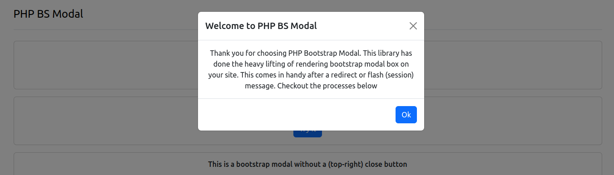

# Bootstrap Modal PHP Component

A lightweight PHP library to generate dynamic Bootstrap modals effortlessly. Customize titles, content, buttons, and attributes programmatically, making it ideal for web applications with reusable and dynamic UI components.



## Features
- Dynamically create Bootstrap modals.
- Customizable titles, body content, and footer buttons.
- Fully compatible with Bootstrap 5.
- Lightweight and easy to integrate.

## Requirements
- PHP 8.2 or higher.
- Bootstrap 5 CSS and JavaScript files loaded in your project.

## Examples

To view a live sample, run a temporary PHP Server

```
php -S localhost:8000
```

Then open on your browser: `localhost:8000/example`.  

## Installation

Install via Composer:

```bash
composer require ucscode/php-bs-modal
```

## Usage

Here is an example of how to use the library:

### Basic Example

```php
require 'vendor/autoload.php';

use Ucscode\HtmlComponent\BsModal\BsModal;
use Ucscode\HtmlComponent\BsModal\BsModalButton;

$modal = new BsModal([
    'title' => 'Welcome Dev',
    'message' => 'This is a bootstrap message',
]);
```

After that, all you need to do is render it.

```php
echo $modal->render();
```

> You can view `example/php-bs-modal.php` for more coding samples


### BsModal Methods

<table>
  <thead>
    <tr>
      <th>Method</th>
      <th>Description</th>
    </tr>
  </thead>
  <tbody>
    <tr>
      <td><code>getBuilder</code></td>
      <td>Get the modal builder instance</td>
    </tr>
    <tr>
      <td><code>getModalId</code></td>
      <td>Returns the id attribute value of the modal</td>
    </tr>
    <tr>
      <td><code>getElement</code></td>
      <td>Return the main modal element</td>
    </tr>
    <tr>
      <td><code>setTitle</code></td>
      <td>Define the header title for the modal</td>
    </tr>
    <tr>
      <td><code>setCloseButton</code></td>
      <td>Whether to show or hide the close button at the modal top right</td>
    </tr>
    <tr>
      <td><code>setSize</code></td>
      <td>Define the size of the modal options. Possible values are <code>sm</code>, <code>lg</code>, <code>xl</code>, <code>fullscreen</code></td>
    </tr>
    <tr>
      <td><code>setCloseOnEscape</code></td>
      <td>Prevent or allow the modal close when <code>esc</code> key is pressed</td>
    </tr>
    <tr>
      <td><code>setBackdropStatic</code></td>
      <td>Prevent or allow the modal to close when the modal background is clicked</td>
    </tr>
    <tr>
      <td><code>setScrollable</code></td>
      <td>Whether to allow the modal generate a scroll bar when the text is too large</td>
    </tr>
    <tr>
      <td><code>setVerticalCenter</code></td>
      <td>Align the modal to the center of the page</td>
    </tr>
    <tr>
      <td><code>addButton</code></td>
      <td>Insert custom button to the footer of the modal</td>
    </tr>
    <tr>
      <td><code>createTriggerButton</code></td>
      <td>Generate a new button that will be used to trigger (open) the modal box</td>
    </tr>
    <tr>
      <td><code>setShow</code></td>
      <td>Display the modal automatically when the page is loaded</td>
    </tr>
    <tr>
      <td><code>addEventListener</code></td>
      <td>Add Javascript event listener to the modal element. See modal events <a href='https://getbootstrap.com/docs/5.3/components/modal/#events' target='_blank'>Here...</a></td>
    </tr>
  </tbody>
</table>

> NOTE: All the setter method can be called by passing an array to the `BsModal` instance, using the method name (without the **set** prefix) as the *key*

## More Examples

```php
$modal = new BsModal([
    'message' => 'This is an example of a modal',
    'closeButton' => false,
    'backdropStatic' => true,
    'closeOnEscape' => false,
    'verticalCenter' => true,
    'size' => 'sm',
    'buttons' => [
      new BsModalButton('Cancel'),
      new BsModalButton('Continue'),
    ]
])
```

You can dynamically update the modal properties

```php
$modal->setTitle('Dynamic Modal')
```

```php
$modal->setMessage('<p>This is dynamically generated content.</p>');
```

## Adding or removing buttons

By default:

- If `true` is not passed to the second parameter of `BsModal`, 
- If no custom button was added during the `new BsModal` instantiation,

An `Ok` button will be automatically added to the modal.

You can remove or add more custom buttons

```php
$button = new BsModalButton();
```

Configure a button attributes

```php
$configuredButton = new BsModalButton('Save Changes', BsModalButton::TYPE_ANCHOR, [
    'class' => 'btn btn-success',
    'onclick' => 'my_function',
]);
```

Add the buttons to the modal

```php
$modal
    ->addButton($button)
    ->addButton($configuredButton)
    ->removeButton(0) // remove button at index 0
    ->removeButton($button) // remove the button instance
;
```

### Rendering the modal

You can get the HTML string of the modal by calling the `render()` method

```php
echo $modal->render();
```

Since the modal (and buttons) implements `Stringable`, you can render them directly

```php
echo $modal;
```

## Accessing the elements

The PHP Bootstrap Modal library is powered by [UssElement](https://github.com/ucscode/uss-element) which provides you with many benefits of manipulating the modal.\
To access many section of the modal element, you can get the `BsModalBuilder` instance

```php
$builder = $modal->getBuilder();
```

To access the modal element itself, you can get the `container` element from the builder

```php
$modal->getBuilder()->getContainerElement();
```

`BsModal::getElement()` method also provides an easy access to the modal container

```php
$modal->getElement();
```

## Modifying element attributes

Since PHP bootstrap modal is composed of [UssElement](https://github.com/ucscode/uss-element)s, you can easily query the elements and make significant updates.

```php
$modal->getElement()->setAttribute('data-custom', 'example-value');
```

 You can query DOM sections such as header, body, or footer


```php
$modal->getElement()
    ->querySelector('.modal-header')
        ->getClassList()
            ->add('custom-header-class')
;
```

```php
$modal->getElement()
    ->querySelector('.modal-body')
        ->setAttribute('id', 'custom-body-id')
;
```

Or as spoken earlier, you can access sections from the builder directly

```php
$modal->getBuilder()
    ->getFooterElement()
        ->setVisible(false)
;
```

### 3. Rendering the Modal

The library generates valid HTML for a Bootstrap modal. You can insert the output into your HTML structure:

```php
<div class="container">
    <?php 
        echo $modal->getTriggerButton()->render(); // The button to open the modal
        echo $modal->render(); // The modal itself
    ?>
</div>
```

# Output Example

```html
<button type="button" class="btn btn-primary" data-bs-toggle="modal" data-bs-target="#exampleModal">
  Open
</button>

<div class="modal fade" id="exampleModal" tabindex="-1" aria-labelledby="exampleModalLabel" aria-hidden="true">
  <div class="modal-dialog">
    <div class="modal-content">
      <div class="modal-header">
        <h1 class="modal-title fs-5" id="exampleModalLabel">Modal title</h1>
        <button type="button" class="btn-close" data-bs-dismiss="modal" aria-label="Close"></button>
      </div>
      <div class="modal-body">
        ...
      </div>
      <div class="modal-footer">
        <button type="button" class="btn btn-secondary" data-bs-dismiss="modal">Close</button>
        <button type="button" class="btn btn-primary">Save changes</button>
      </div>
    </div>
  </div>
</div>
```

### Auto Display

By default, the bootstrap modal will be hidden unless triggered by a button.\
To automatically display the modal on page load, use the `show` option

```php
$modal = new BsModal([
  'message' => 'This will display on page load',
  'show' => true,
])
```

After that, render it on the page using the `$modal->render()` method

### Trigger Events

To trigger events on the modal, you can pass options prefixed with `event:`

```php
$modal = new BsModal([
  'message' => "This will trigger multiple events",
  'event:show.bs.modal' => 'showFunc',
  'event:hidden.bs.modal' => 'hiddenFunc',
]);
```

The `showFunc` and `hiddenFunc` are functions that should have been defined in the javascript environment.\
The process generates javascript event listener syntax similar to the ones below

```js
element.addEventListener('show.bs.modal', showFunc);
element.addEventListener('hidden.bs.modal', hiddenFunc);
```

If the event values are not valid function names, the event will not be added

## License

This library is open-source software licensed under the [MIT license](LICENSE).

## Contributing

Contributions are welcome! Please fork the repository and submit a pull request with your changes.

## Support

For any questions or issues, please open an issue on the [GitHub repository](https://github.com/your-vendor-name/bootstrap-modal-generator).


